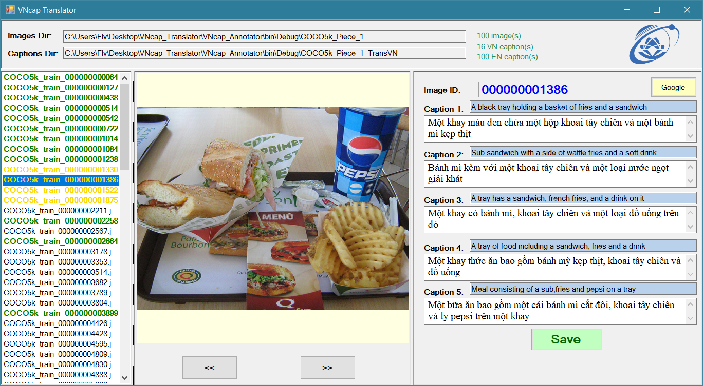

# VNcap_Translator
The tool support Human to translate MS COCO dataset

##  Translation Guide
* Omitting specify names (such as New York’s Chinatown, Mulholland Drive,...), number (house address, specify time of clock,...), adjectives that expresses personal feeling.
* Allow to keep English words that is commonly used in Vietnamese language (vest, pizza, laptop, tivi,...)
* In the case of conflict between caption and image (e.g. wrong object’s color, incorrect sexual of person, caption is totally irrelevant to the image,...), the content of image (not the caption) should be the crucial factor to make final decision.
